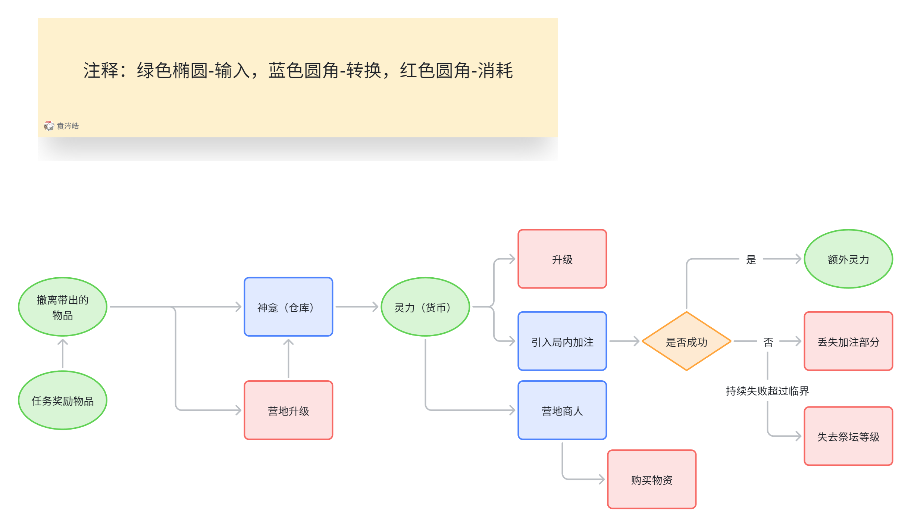
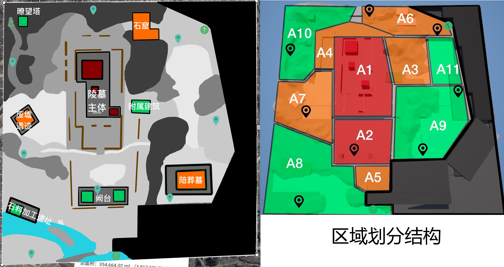
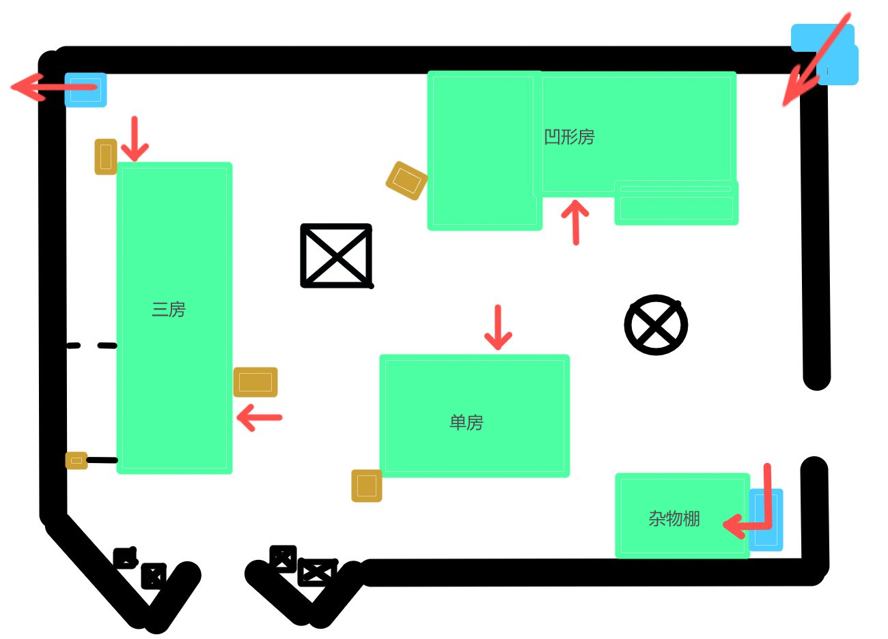
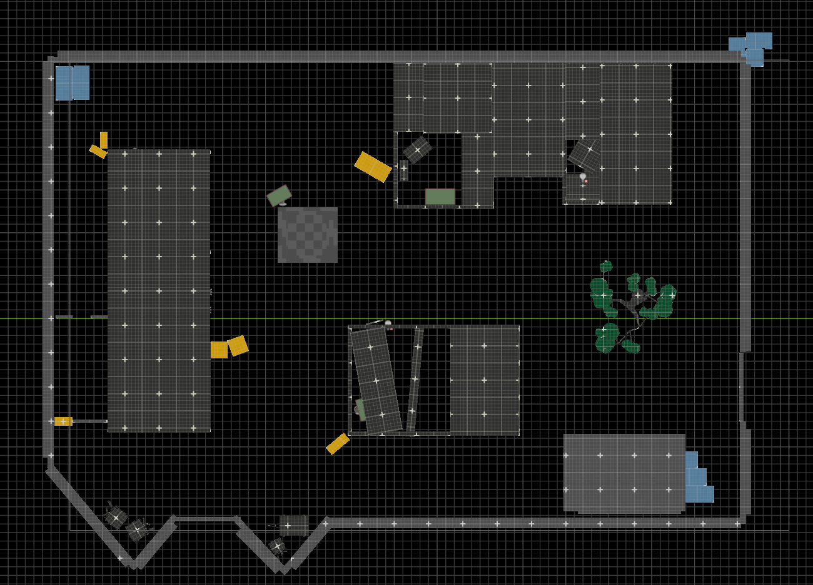
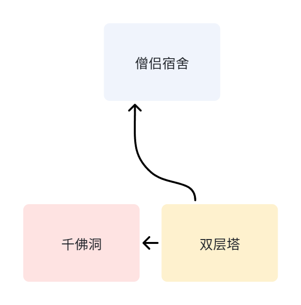
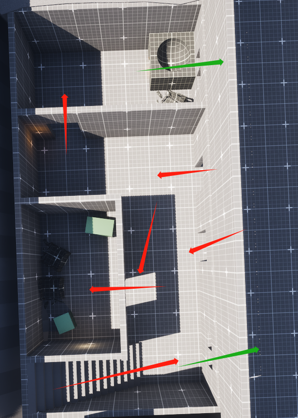

# 25腾讯星跃实战营

[TOC]

## 0.项目概述

本项目为腾讯星跃实战营课题实践项目。旨在完成中式恐怖+摸金盗墓风格的搜打撤游戏原型。该项目从0开始，完整实践：概念→玩法原型→关卡搭建→测试改进的流程。

## 1.我的职责

- 设计基于搜打撤基础玩法的**特色玩法**
- **设计&搭建**重点POI及周边区域的关卡白盒
- **配置**对应区域的**怪物及物资产出**

## 2.工作内容

### 2.1玩法设计：

**核心体验：** 中式微恐怖，贪婪，恐惧=收益，盗墓笔记式的探险家角色

**设计定位：** PVE为主+PVP

#### 2.1.1局内玩法：

**目标局内体验：** 前期(<7min)带入资源有限，紧张小心；中期(7~18min)加注局外资源获取能力，提升压力水平；后期(18~30min)获得战斗胜利撤离，施压达到情绪峰值。

- 祭坛加注系统：
  - 补给祭坛：献祭仓库内货币或局内搜刮物品产出补给品
  - 副本祭坛：献祭仓库内货币，开启区域副本战斗，完成战斗获得局内强化及搜刮物资奖励。献祭等级越高，副本战斗强度越强，奖励越丰厚。

#### 2.1.2局外成长：

**体验目标：**类RPG成长；基地建设

**局外成长系统组成：**玩家角色技能树+营地构建

**a.经济系统组成：**

 撤离物品属性：稀有度，灵力含量，占用空间（负重、堆叠数）

 货币单元：灵力

1. 收入：撤离带出的物品
2. 转换：在神龛转换物品为灵力，灵力购买商人的物品，灵力提升玩家技能等级等
3. 消耗：购买商人的服务，局内战斗使用，局内加注失败等
4. 仓储：物品仓储格 + 灵力存储池

**b.物资相关**

分类：POI中容器产出；NPC击杀掉落（普通/精英/BOSS/猎杀者）；下注成功之后的宝箱产出

等级：(稀有度从低到高) 白，绿，蓝，紫，红

用途区分：任务/建筑/制造素材；大量换取灵力的物品

**c.营地建设**

商人：武器弹药商人，护甲装备商人，医疗物资商人，杂物商人

- 提供：任务；随着商人等级而扩充的商品内容和可购买上限；无需素材的恢复服务
- 伴随：工作台
- 建设度系统：与商人交互（完成任务，提供对应物资，完成交易）提升建设度，达到一定程度后解锁更高级物品

神龛：升级终端+仓库+物资转换为灵力

- 玩家在祭坛处提交物品获取对应技能树分支的升级
- 提交物品升级祭坛，提升物品和货币存储上限
- 献祭（出售）物品成为货币

### 2.2 关卡白盒搭建：

#### 2.2.1 大地图总览：

 

**我的负责区域：** A3 & A6

#### 2.2.2 A3 附属建筑区域设计

| 项目         | 内容                                                         |
| ------------ | ------------------------------------------------------------ |
| POI层级      | 三级                                                         |
| 定位         | 动线交汇路口,局部地标,遭遇战场所                             |
| 核心体验     | 进入核心POI的前哨战/观察哨所                                 |
| 预期停留时长 | 3~4 分钟                                                     |
| AI配置要求   | 低数量, 低强度                                               |
| 产出         | 低价值素材, 中少量，低稀有度补给                             |
| 区域结构     |  |

{{ video bilibili:BV1h1jp6ZErZ title="搜打撤区域关卡白盒演示A3部分" }}

**POI layout**：

 **设计目标：**

 - 多进出口的小型中枢建筑群。
 - 在区域内进行中短距离交火。
 - 多迂回路径。
 - 提供观察核POI的高点/狙台位置。

**a.凹形房**

**设计目的：提供主要补给**

- 该房内物资：医疗等补给物资
- 右侧房为大窗，搜刮物资存在被外部敌人从窗外射击的可能性

- 左侧房的窗户为蹲姿掩体窗，但天花板开口更大，增加投掷物反制机会

**b. 联排三房**

**设计目的：作为长条安全通道的通往单向出口**

- 该房以两入口为核心
- 中间物资箱存放少量基础材料

**c. 塌粱单房**

**设计目的：提供可搜刮杂物箱，POI内的观察支点**

- 中间隔断，前后都有蹲姿掩体窗，单出口
- 内部物资为基础产出，左侧物资箱可能产出少量补给

**d. 杂物棚**

**设计目的：作为观察核心POI侧面出入口的哨塔**

- 旁边附带单向攀爬出口
- 可以攀爬至棚顶获得对核心POI进出口的观察优势，但同时受外围区域的集火

#### 2.2.3 A6 石窟区域设计

| 项目         | 内容                             |
| ------------ | -------------------------------- |
| POI层级      | 2级                             |
| 定位         | 室内战, 中高价值物资产出点, 副本祭坛 |
| 核心体验     | 临近多出生点的开场战，获得强化的重要节点     |
| 预期停留时长 | 5~7 分钟                         |
| AI配置要求   | 中数量, 中强度                   |
| 产出         | 中高价值素材, 中量补给, 精英怪物副本 |
| 区域结构 |  |

{{ video bilibili:BV1xZjp6SEuv title="搜打撤区域关卡白盒演示A6部分" }}

**a.僧侣宿舍：**

**设计目的：补给物资产出点；双层塔和千佛洞的观察埋伏点**

- （左1）一层：绿色箭头为窗户，红色箭头为预期动线，绿色box为物资产出点。1F顶部的**厨房观察房间**和中部**储藏室**产出补给组成。

- （右1）二层：黄色box为掩体。2F由顶部**住持房间**和底部**集体宿舍**组成

**b.双层塔**：

**设计目的：中高价值物资产出点，室内回环交战场所**

- （左一）双层塔二层，中部区域为**藏经阁**，包含中价值物资产出点x3，和高价值物资产出点x1。通往千佛洞二层平台。
- （右一）双层塔一层，中部区域为**讲堂**，中低价值物资x2。

**c.千佛洞**：

**设计目的：激活中部祭坛进行副本战斗。祭坛生成单个近战类精英敌人，具备单层小范围aoe攻击能力。** 

- （左一）通往双层塔二层，由坡道或跳下平台下到1层
- （右一）通往双层塔一层

