[TOC]

# 一、基础信息：

游戏名：Iris and the giant / 爱丽丝与巨人
开发：Louis Rigaud
发行：Goblinz Publishing，Maple Whispering Limited，Mugen Creations联合发行
上线平台：Steam、Epic、NS
类型：牌组构建式类肉鸽
故事简介：你扮演爱丽丝，一位陷入抑郁症苦痛的少女。她必须勇敢地面对她想象世界中的恐惧。踏入忧郁和怪物相伴的冒险旅程，挖掘埋藏的记忆。

# 二、游玩循环：

## 2.1 游玩目标

- 探索/通关：玩家在一轮游戏当中进入更高的层数，遇见新敌人和机制，直到击败最终boss通关。期间不断解锁新卡牌/能力。
- Build构筑：玩家通过多轮次的游戏熟悉卡牌，创造build策略空间，给予玩家尝试多流派build的乐趣。
- 剧情驱动：玩家每次收集【回忆点数】时播放动画，以碎片化叙事激励玩家凑齐剧情拼图。并升级技能树强化 `Build构筑` 的乐趣
- 成就挑战：通过自我设限，让后期熟练玩家施展技能，并奖励【虚幻伙伴】强化 `Build构筑` 的乐趣。

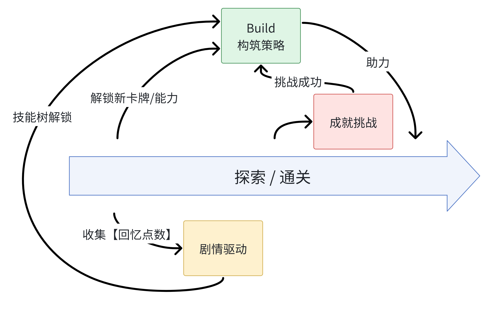

## 2.2 核心循环

  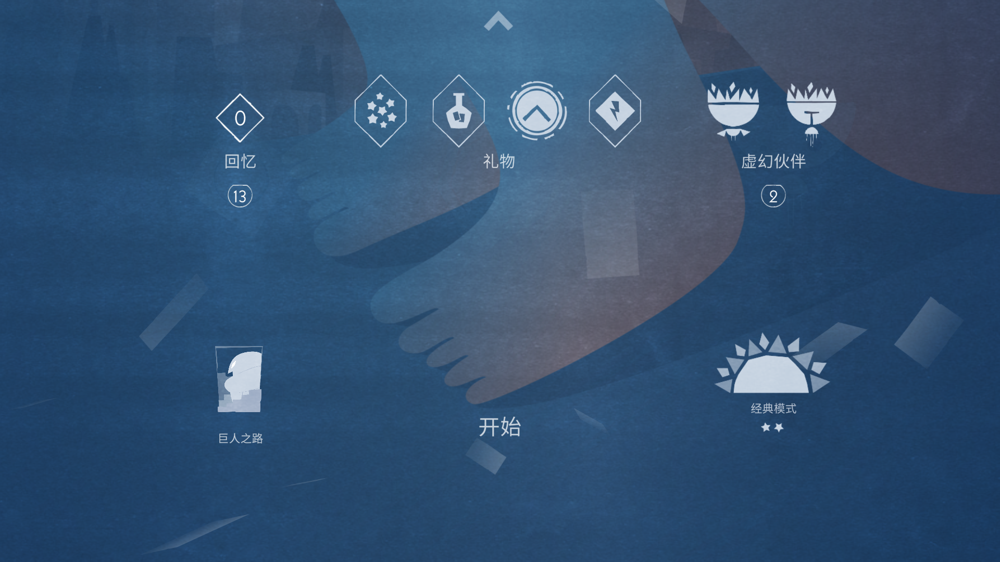
  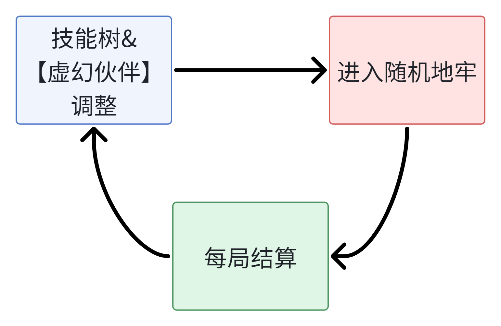

游戏依照rogue-lite：`长期局外成长+随机局内战斗+卡组build` 的模式展开。
玩家在主菜单**调整[【回忆】](###3.3.1回忆系统)和[【虚幻伙伴】](###3.3.2虚幻伙伴系统)**之后，点击开始按钮**进入【地牢】开启新一轮游戏**。进入随机生成的【地牢】，玩家消耗卡牌与各类【恶魔】战斗，探索道路，寻找【回忆点数】和各类补给，逐渐进入更高更有挑战的地牢层数，直到耗尽可用【卡牌】、被[【恶魔】](3a.场地信息：)击败或者击败最终boss**结算本轮游戏**。玩家会依据本轮游戏表现获得下一轮游戏生效的奖励【礼物】。

## 2.3 局内循环

  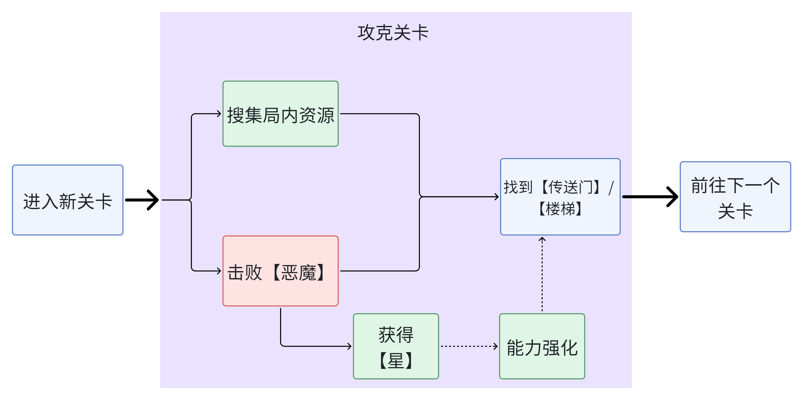
  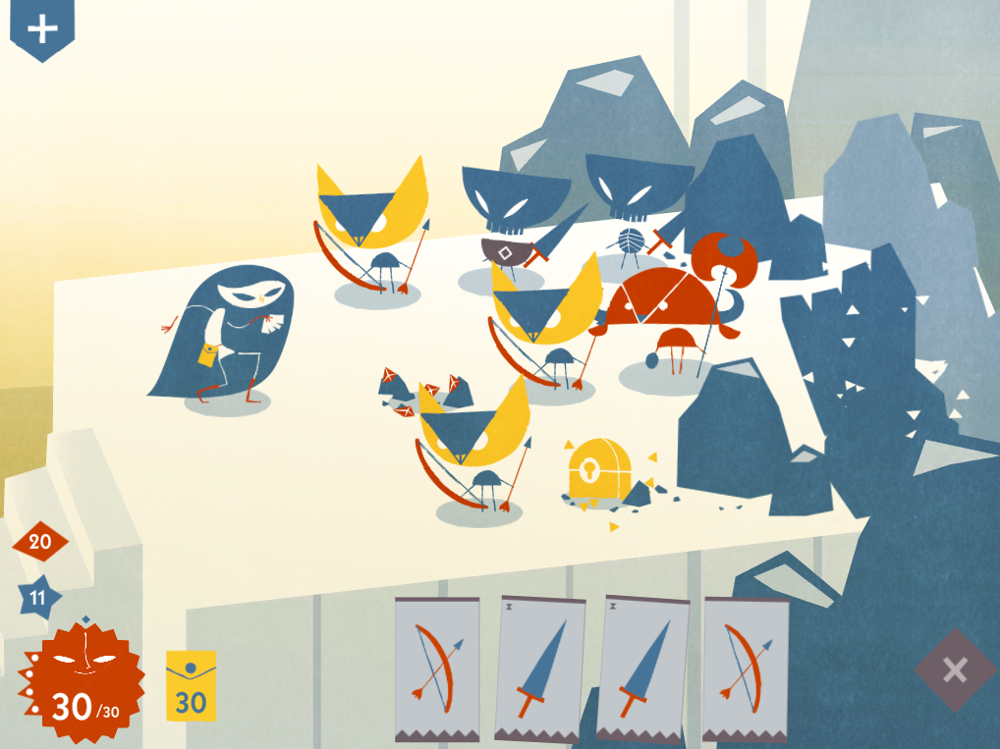

​	玩家进入【地牢】之后需要在每层关卡中与【恶魔】战斗获得【星】，与场景互动收集【水晶】获得特殊宝箱，开启各种【宝箱】补充卡牌，寻找前往其他层【地牢】关卡的【传送门】/ 【楼梯】。

*详细内容参照：战斗系统，场地交互系统，局内构筑与成长系统*

# 三、核心系统设计

## 3.1 角色系统

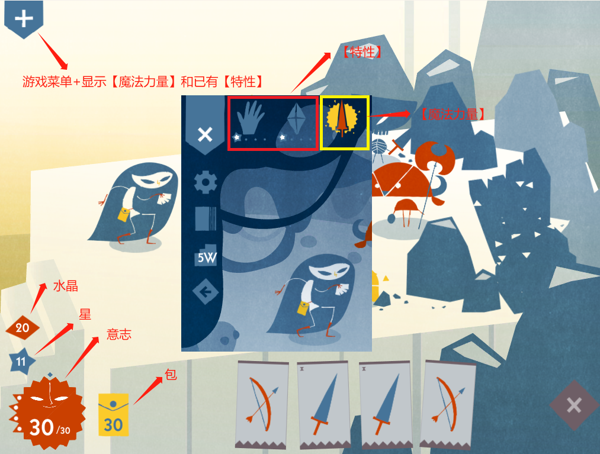

**角色属性：**

- 额外信息菜单：

  - 交互逻辑：

    - 点击展开UI，向下展开系统功能菜单，右侧横向左对齐多排展示【特性】、【回忆】和【魔法力量】图标；从左到右+从上到下排序展示顺序为：【特性】>【回忆】>【魔法力量】>【其他Buff】

    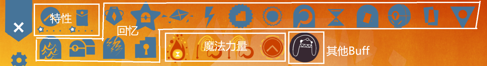

    - 展开后：鼠标悬浮/选中【回忆】、【特性】或【魔法力量】图标，玩家角色下方出现对应的效果描述。
    - 点击关闭UI, 恢复原本

- **【意志】**：玩家的生命值，表现形式为 `Current_Will / Max_Will`

  - 交互逻辑：

    - 点击UI，触发`Panel_Will` 菜单，

  - 显示逻辑：
    - 当玩家受到普通伤害时：`Current_Will-=i` ;

    - 当玩家受到最大【意志】伤害时： `Current_Will-= i`  , `Max_Will-=i`;

    - 当 `Current_Will==0`，触发 `End_State_Check()` ;

    - 按照剩余【意志】百分比展示填充效果：

  

    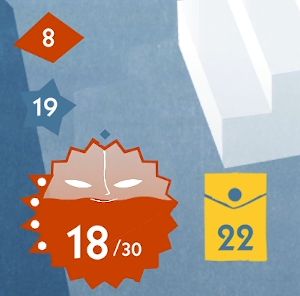
  

- **【水晶】数量：**当玩家收集到足够数量的【水晶】之后可以获得稀有【宝箱】，开启后可获得稀有卡牌

  - 显示逻辑：
    - 数字递减；当玩家收集到【水晶】时，`int Crystals_Needed--` ；
    - `当int Crystals_Needed==0 ` 时，播放动画 `Animation_Crystal_Full`，触发 `Open_Chest(ChestType Red)` ；

- **【星】数量：**玩家击败敌人获得【星】，当玩家收集到足够数量的【星】之后获得升级，获得【特性】（Traits）或者打开【宝箱】

  - 交互逻辑：
    - 点击UI：触发 `Panel_Traits` 菜单，遍历`Traits[i][j]` 并展示玩家现有的【特性】；`j==0` 的【特性】代表未生效，展示为灰色；`j=!0` 的【特性】代表生效，UI为蓝色，并在下方点亮 `j` 个星星图标 ；点击底部×按钮关闭`Panel_Traits` 菜单；

  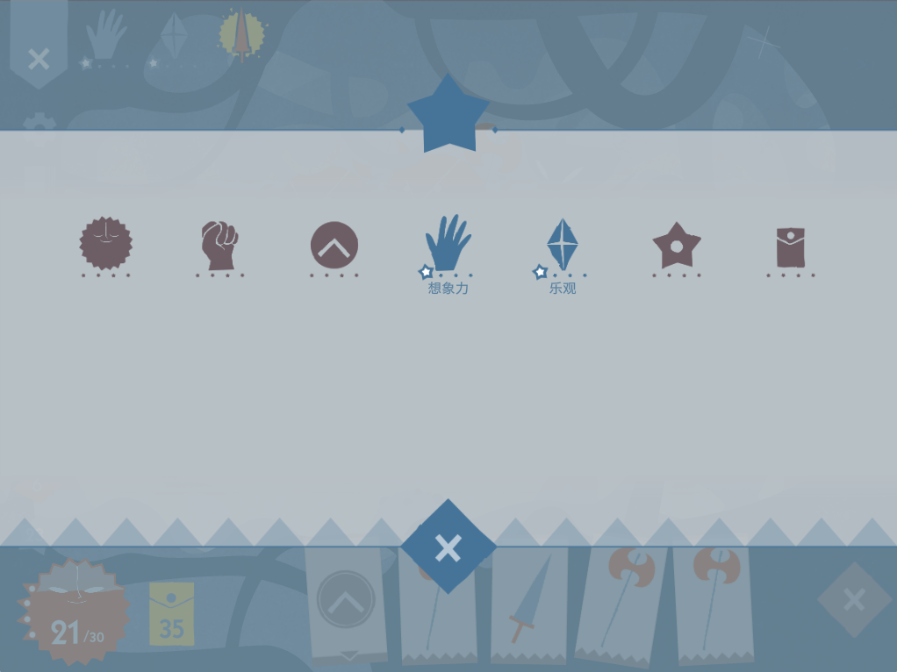

  - 显示逻辑：
    - 数字递减；当玩家收集到【星】时，`int Stars_Needed--` ；
    - `当int Crystals_Needed==0 ` 时，播放动画 `Animation_Crystal_Full`，触发 `Stars_Reward ()` ，开启`Level_Up_Reward` 菜单；
    - 玩家选择特性时，`Traits[i][j]` 中 `j+=1`；玩家选择【宝箱】时，触发 `Open_Chest(ChestType Normal)` 

  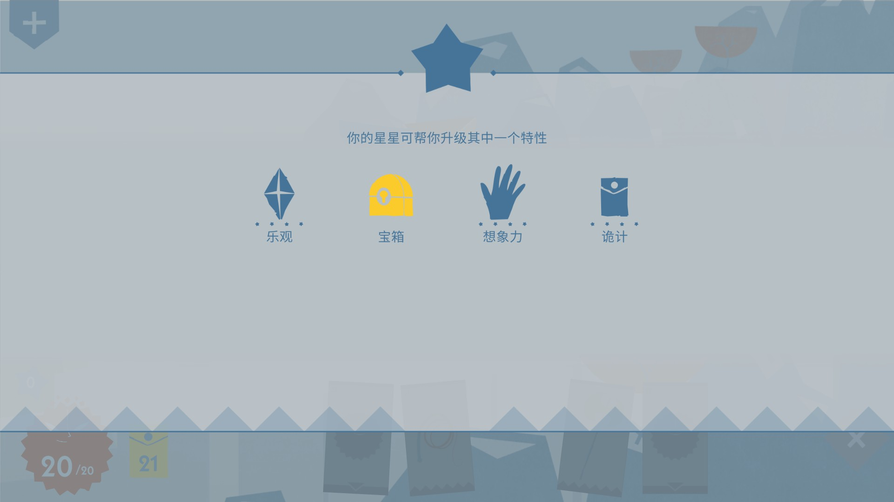

- **【包】：**玩家的卡组池
  - 显示逻辑：
    - UI显示【包】中剩余总卡牌数 `int PlayerCards_Number` ； 
    - 每次从【包】中抽取卡牌后：`Count_in_Bag()` ，返回 `int PlayerCards_Number ` ;
  - 交互逻辑：
    - 点击UI：触发 `Bag_Panel` 菜单，遍历`Cards_in_Bag[i][j]` 并分类展示玩家持有的【卡牌】及其对应数量；
    - 堆叠逻辑：同类卡牌依次从左往右堆叠，最右侧的一张展示卡面
    - `Bag_Panel` 菜单鼠标交互：不选中/悬停任何一类卡牌时，展示游戏提示；悬停/选中任一一类卡牌时，展示 `Card_Effect` , `Special_Effect` ,`Card_Name` , `Card_Number`

  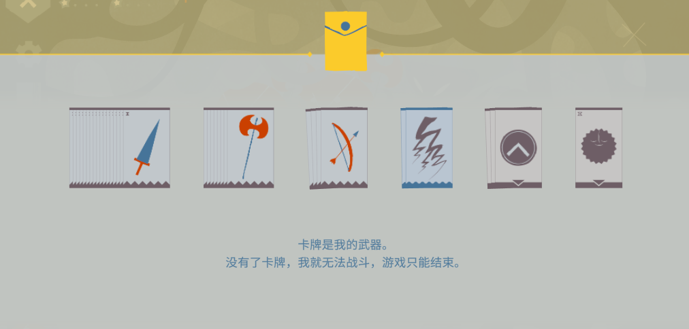
  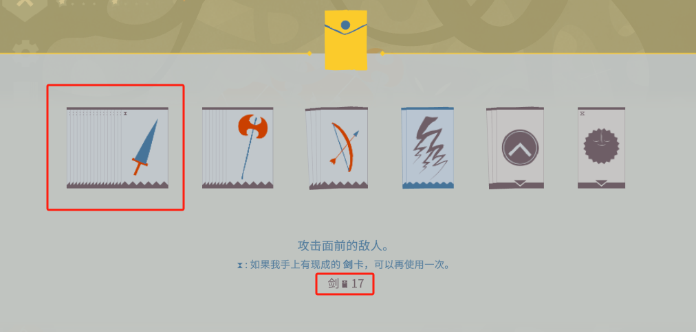

## 3.2 局内系统

### 3.2.1卡牌

#### 1a.卡牌属性：

**卡牌类基础属性：**

默认情况下卡牌都是一次性消耗品；

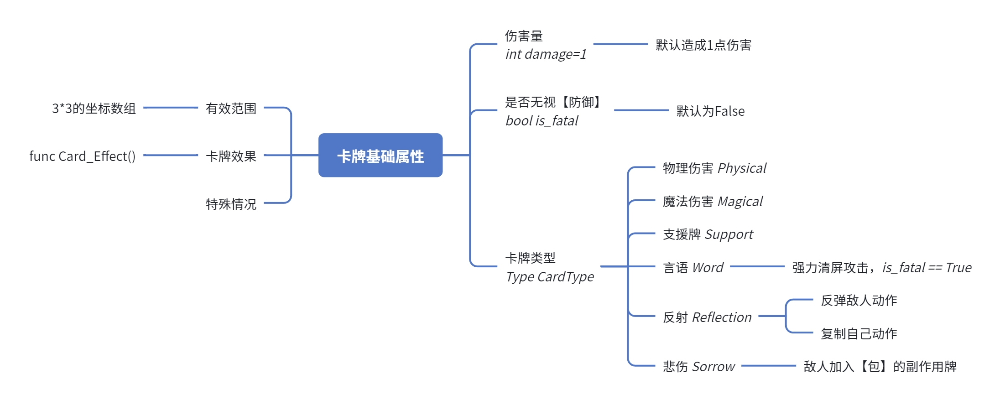

卡牌的特殊情况

- 【回旋镖】：打出之后会回到【包】中，后续会被重新抽出；
- 【重复】：
  - 【同种】： 允许玩家同一回合打出同种的其他手牌；比如，本回合打出一张“剑”，则该回合内可无限制打出手牌中的任意张描述为“剑”的卡牌（“骨剑”、“邪剑”都可），但无法打出“斧头”；
  - 【任意】：  允许玩家在同一回合打出其他任何一张手牌

#### 1b.交互逻辑：

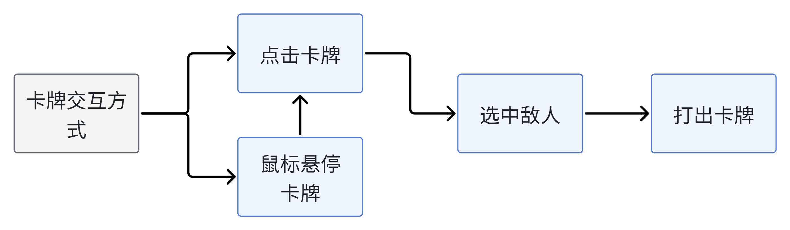

- 鼠标悬停：卡牌浮动并停止；浮动卡牌 `Scale×1.1` ；玩家角色下方展示 `Card_Effect` , `Special_Effect` 和 `Card_Number` ；

 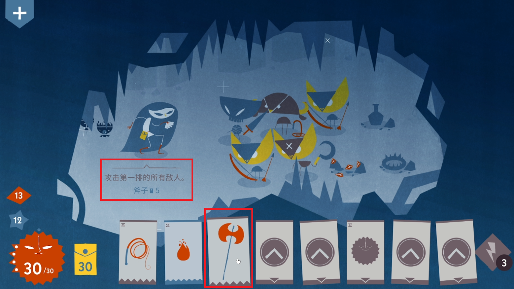

- - 鼠标点击选中：卡牌浮动，持续播放 `Card_Shake` 动画，浮动卡牌 ``Scale×1.5` ；卡牌可作用的对象底部闪烁；

  - 鼠标悬停至其他卡牌：保持已选中卡牌效果不变化，同时展现该卡牌悬停效果；
  - 鼠标悬停至可作用对象：生效范围对象底部闪烁变黄色高亮，其余可作用对象底部仍闪烁；

  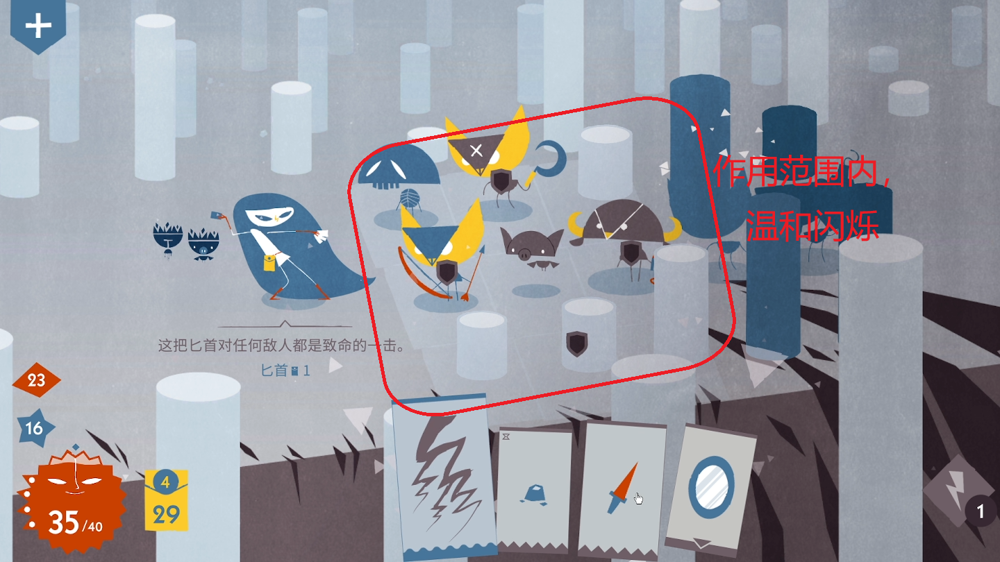
  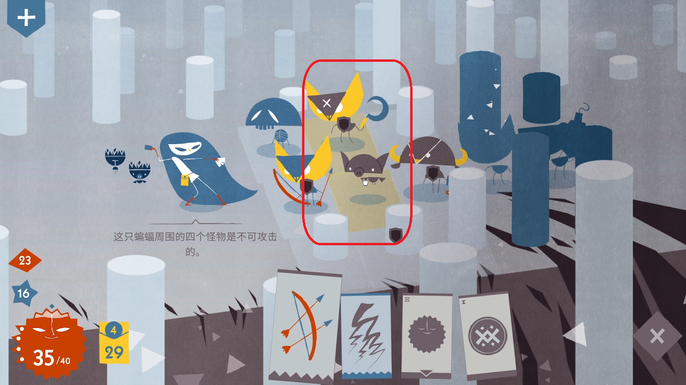

### 3.2.2战斗

#### 2a.自动抽卡：

- 【恶魔】回合之后的下一次玩家可行动回合进行抽卡；
- 每次抽卡补满至**自动抽取最大手牌数**，即抽取 ` AutoMax_Cards_Hand - Current_Cards_Hand`  张卡牌
- 当 `Current_Cards_Hand>AutoMax_Cards_Hand` 时不执行自动抽卡 出现情况参照[卡牌获取](####4a. 卡牌获取)

#### 2b.标准玩家行动回合：

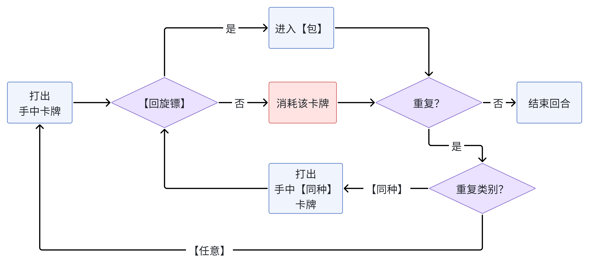

#### 2c.玩家攻击伤害判定：

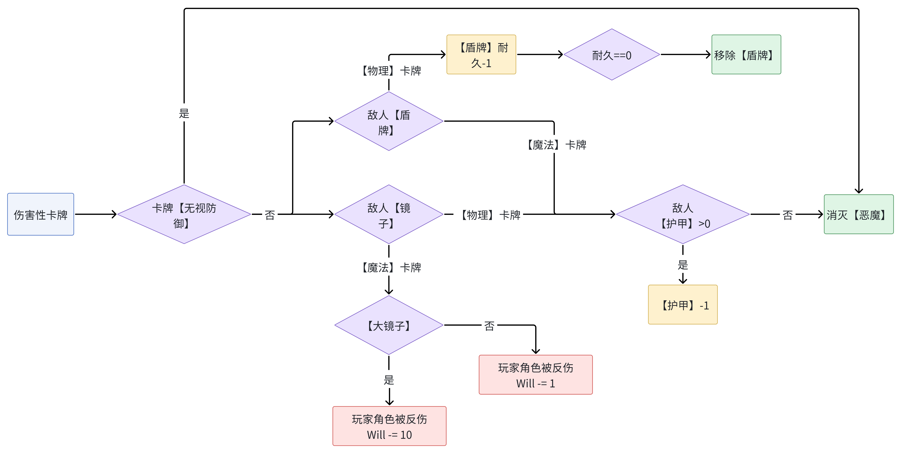

- 特殊情况：
  - 【石化】：【恶魔】无法行动，交互机制改变为【石子】，无法获得【星】；但【偷窃】类卡牌效果相同；

#### 2d.【恶魔】行动：

- 行动逻辑：

  - 当【恶魔】未被控制（眩晕/石化），位于可攻击玩家位置，就会进行预设行动。当所有可行动【恶魔】完成行动时，进入到玩家回合。

  - 【恶魔】预设行动类型：
    - 近战攻击 / 近战法术：仅在第一排时会行动；
    - 远程攻击 / 远程法术：在3x3的范围内任意位置上都会行动；
    - 位移：往前移动一格；该行动优先于其他行为；

- 显示逻辑：

  - 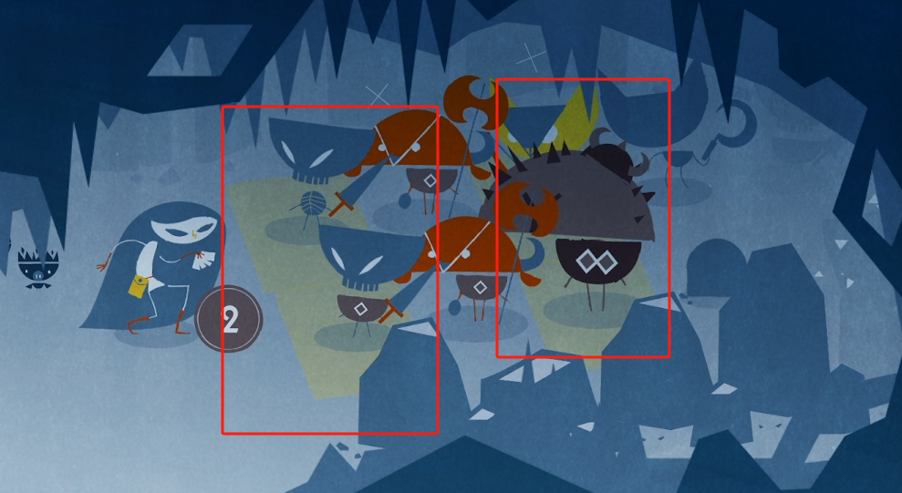
  - 敌方回合进行行动的【恶魔】底部出现黄色高亮，执行顺序按照从上到下，从左到右的顺序执行；当【恶魔】的行为是在场地上新增【恶魔】时，该【恶魔】无视站位最后行动

### 3.2.3场地交互

#### 3a.场地信息：

  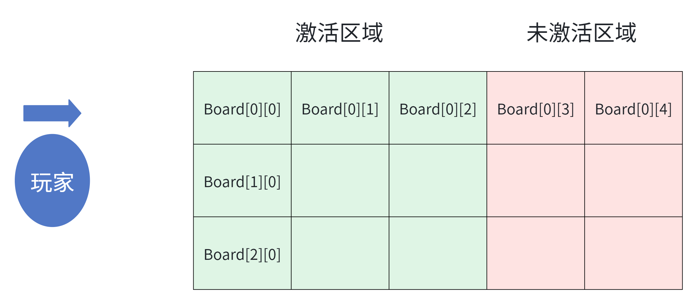
  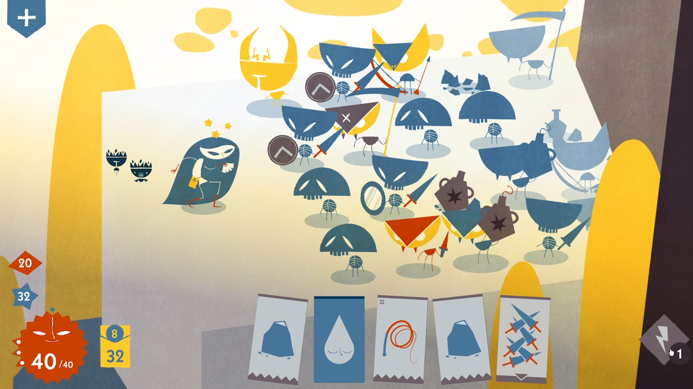

- 场地 `Board[i][j]` ，`0<i<4`;
- **激活区域**：当 `Board[i][j]`，`j<3` 时，处于这个坐标集以内的对象可与玩家交互。
- **未激活区域**：当 `Board[i][j]`，`j>3` 时，玩家无法交互该区域内的对象，但可以看见该区域内的对象轮廓。
- **场地上出现的对象：**
  - 【恶魔】：玩家需要打败的敌人
  - 【物品】：包括【宝箱】、【水晶堆】、【瓶子】和【石子】；
    - 【陷阱】：触碰到玩家时，产生负面效果/伤害的特殊【物品】，自动生成或因【恶魔】能力产生；

  
  
  

  - 【墙】：单纯的障碍物，可被摧毁
  - 【回忆点数】
  - 【红星】：击败boss后的特殊掉落物；
  - 【通道】：离开本层关卡的点击交互对象；有多种形式；
    - 【楼梯】：前往不同楼层，有主/次区分，前往不同路线；
    - 【传送门】：条件开启，进入额外关卡；完成之后自动前往原路线的下一层；

- **交互模式：**
  - 使用卡牌：满足卡牌效果的对象，使用卡牌会产生对应的效果；详细操作逻辑参照 [卡牌系统](###3.2.1卡牌)；
    - 对【物品】使用伤害卡牌并生效：使【物品】损坏，减少奖励或消失；
    - 对【墙】使用伤害卡牌并生效：削减其生命值，归零则消失；
    - 对【恶魔】效果参照：[伤害判定](####2c.玩家攻击伤害判定)
  - 鼠标悬停：放置在对象上，玩家角色下方出现该对象的描述：`Demon_Detail`或者 `Item_Detail`，如果是墙 `Wall` 则不做任何显示；
  - 直接鼠标点击：
    - 【物品】：触发物品[本身效果](3.3.4局内构筑与成长)；
    - 【回忆点数】：立即播放未解锁的【回忆】剧情动画，音频仅输出动画音频；动画结束或播放期间玩家点击鼠标左键立刻中断并返回之前的关卡；
    - 【红星】：开启 `RedStar_Panel`

#### 3b.位移系统：

  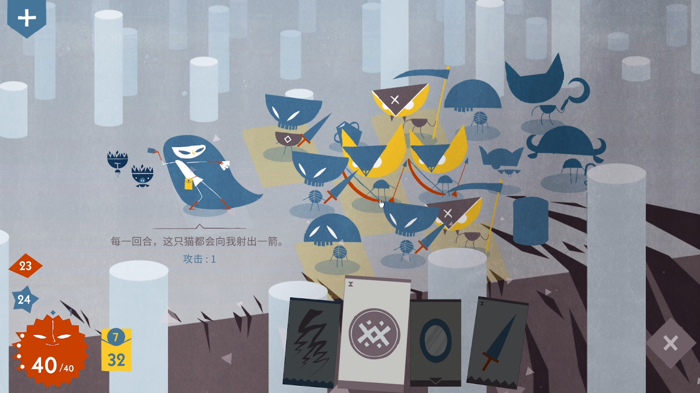
  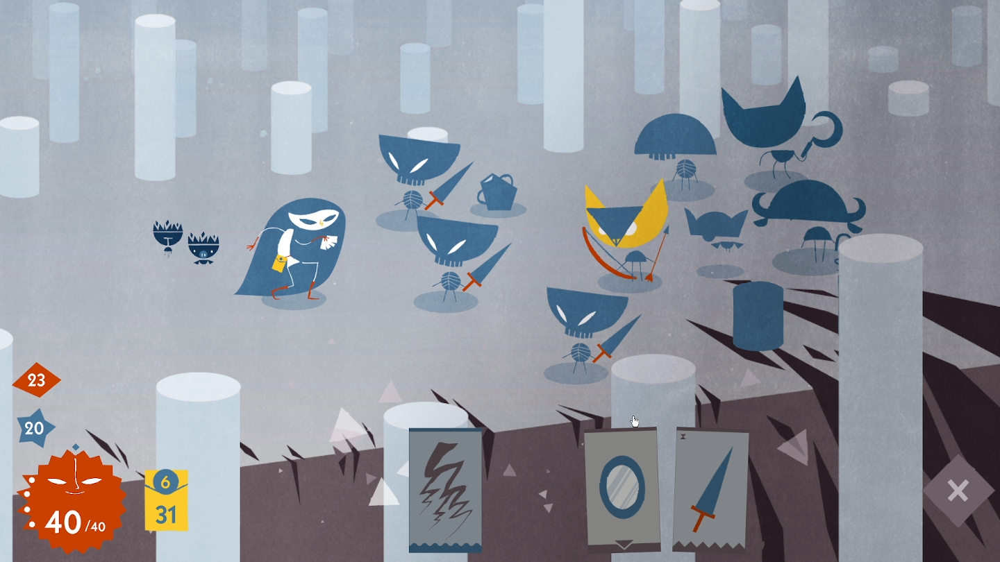
  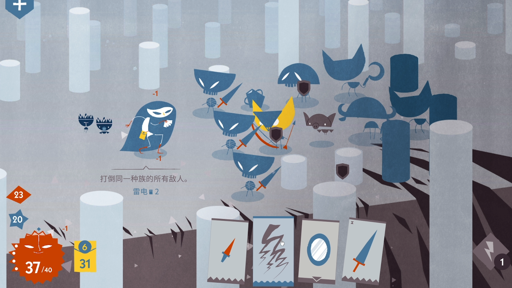

玩家和【恶魔】的行动会改变场地上各对象的位置状态，使每回合产生动态变化；

**位移逻辑：**

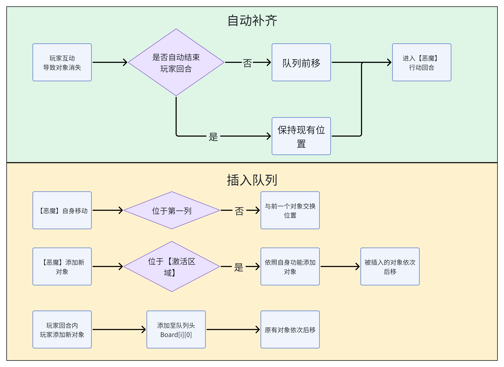

### 3.3.4局内构筑与成长

#### 4a. 卡牌获取

**交互【瓶子】：**

- 当【瓶子】为黄色+卡牌图标时，点击交互该瓶添加两张随机卡牌到【包】中

**使用特殊卡牌：**

- 使用带 `偷窃功能` 的卡牌：满足卡牌偷取条件之后，依据被偷窃对象（【物品】和【恶魔】均可）

- 使用【锻造】卡牌：使用该卡牌之后，开启 `Anvil_Panel` 菜单，固定从`剑、箭矢、斧头、匕首、偷取` 五种卡牌中选取一种2张加入【包】

**打开【宝箱】：**`Open_Chest(ChestType Chest)`

  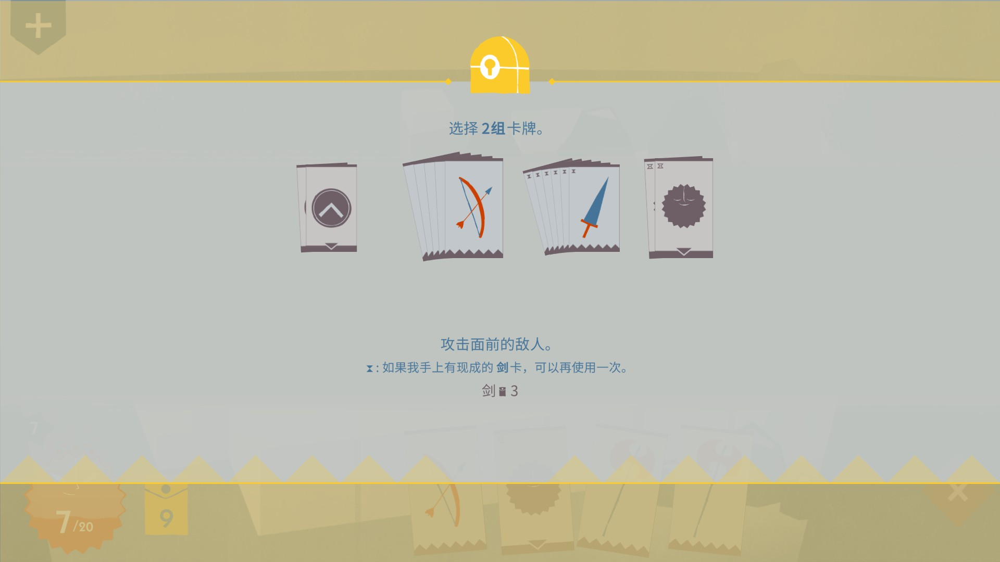
  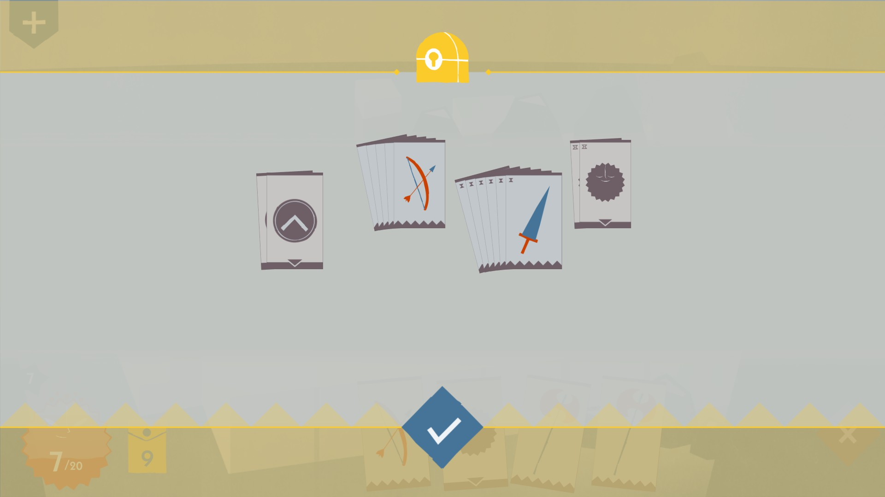

- 宝箱来源：场地上出现；【星】数量满后可选；【水晶】数量满后出现
- 交互逻辑：
  - 开启 `Chest_Panel(ChestType)` , 玩家选择卡牌组，被选中的卡牌组向上抽出，点击下方确认按钮关闭面板；
  - 选择的每组卡牌各添加一张到现有手牌，其余加入【包】中供后续抽出；

#### 4b. 水晶获取

**交互【瓶子】：**

-   点击该类【瓶子】，`int Crystals_Needed--` 之后瓶子消失，触发场地移动逻辑；

**使用特殊卡牌：**

- 使用添加一个水晶的卡牌，`int Crystals_Needed--`

**交互【水晶堆】**

-  点击，`int Crystals_Needed--`；同时水晶堆包含的水晶总数减少 `int Crystal_Pile--` ，当 `Crystal_Pile==0`  水晶堆消失，触发场地移动逻辑；

#### 4c. 星获取

**交互【瓶子】：**

-   点击该类【瓶子】，`int Stars_Needed--` 之后瓶子消失，触发场地移动逻辑；
-  点击该类【瓶子】，玩家会失去3颗星，`int Stars_Needed+=3, Total_Stars_Gained -=3` , 之后消失，触发场地移动逻辑；

**击杀【恶魔】**

- 当成功击败非[【石化】状态](####2c.玩家攻击伤害判定：)的【恶魔】获得一颗星，`int Stars_Needed--` 

## 3.3 局外成长系统

### 3.3.1回忆系统：

- 【回忆】：作为玩家的永久成长技能树。为玩家提供主要的局外成长。

- 【回忆点数】：玩家在局内游玩过程中发现的特殊战利品。局内获取时通过动画完成叙事功能。当轮游戏结算之后提供点亮技能树的技能点。

- 玩家在局内获得【回忆点数】，在结束当局游戏并结算之后，玩家点击【主界面】的 `回忆` 进入技能树点亮环节，点亮的技能会作为永久生效的强化，在每局游戏中持续生效；

  
  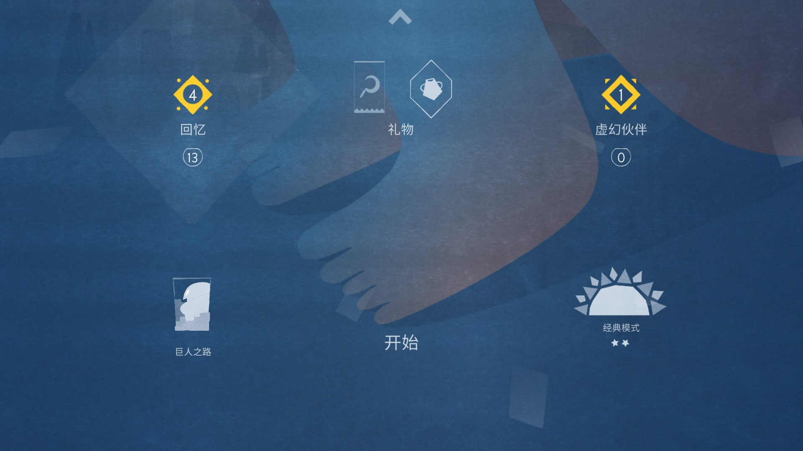

- **UI交互逻辑：**
  - 【主界面】时：菱形图标内数字显示尚有多少点数还未分配，下方数字显示已点亮多少技能；
  - 【回忆】界面内：
    - 【回忆】技能树无先后顺序，玩家可以点亮任一技能；
    - 鼠标悬停在技能图标：展示对应技能描述
    - 点击已点亮的技能：选中图标时图标放大1.1倍；上两排的技能在右上方向出现 `X` 按钮，下两排技能在右下方出现，中间排技能在正下方出现；点击 `X` 按钮之后从**黄底白圈**变为**蓝底**
    - 点击未点亮的技能：选中图标时出现蓝色内勾线，`√` 按钮位置逻辑同已点亮时；点击按钮之后**蓝底图标**变为**黄底白圈**
    - 二选一技能：双向箭头连接的两个技能为二选一技能，仅能点亮一个；两者其中一个已点亮时，点亮另一个会使之前点亮的熄灭；
      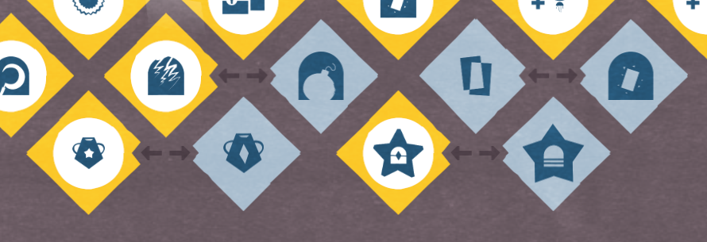
    - 点击底部`√` 按钮保存技能树；

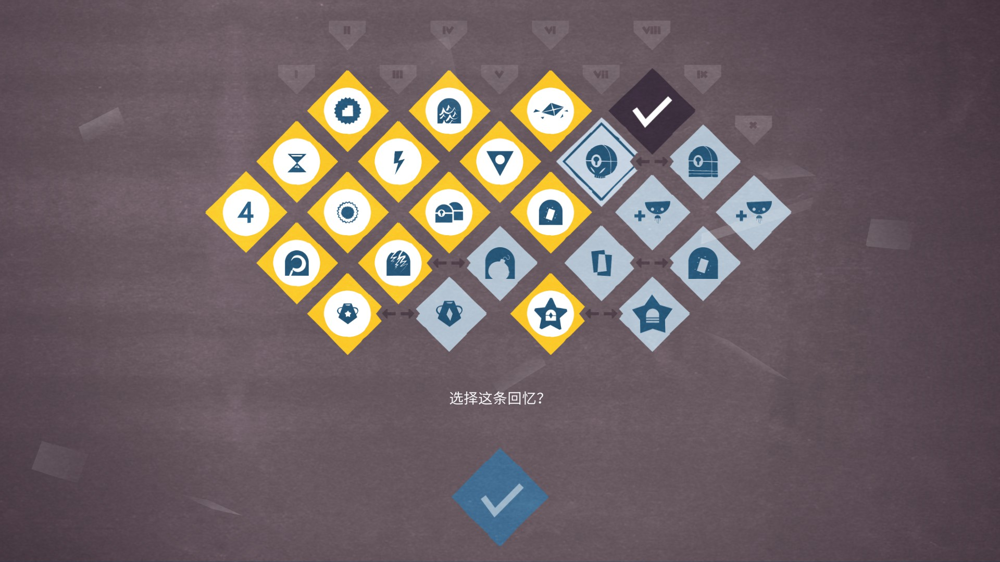

### 3.3.2虚幻伙伴系统：

- 【虚幻伙伴】：完成一系列挑战之后可以发现并解锁的BUFF，提供额外的游玩目标和局外成长功能；玩家可用的最大伙伴数量受【回忆影响】

  
  

- **UI交互逻辑：**
  - 【主界面】时：菱形图标内数字显示可用伙伴空位是多少，下方数字显示已携带伙伴数量，同时显示已选择的虚幻伙伴剪影；

    - 【虚幻伙伴】菜单内部：
      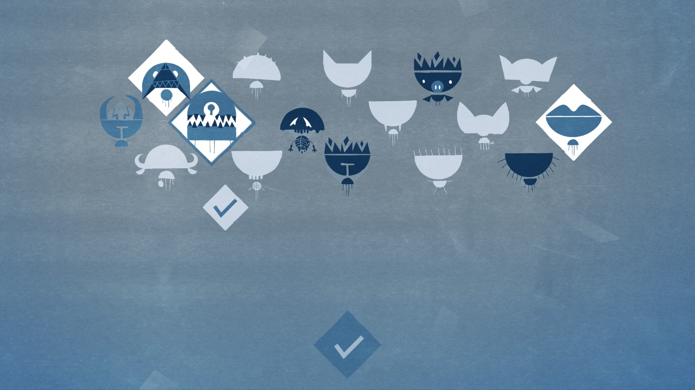
      - 已激活伙伴：白底+完整细节图标；已发现未激活伙伴：完整细节图标；未发现伙伴：白色轮廓；
      - 选中效果：伙伴图标放大1.2倍，周围出现 `√` 按钮（按钮出现逻辑同【回忆】菜单）；伙伴图标后出现白底+蓝色边框；

      - 悬停效果：已发现伙伴：面板中下部出现伙伴效果描述；未发现伙伴：面板中下部出现解锁伙伴需要满足的条件
        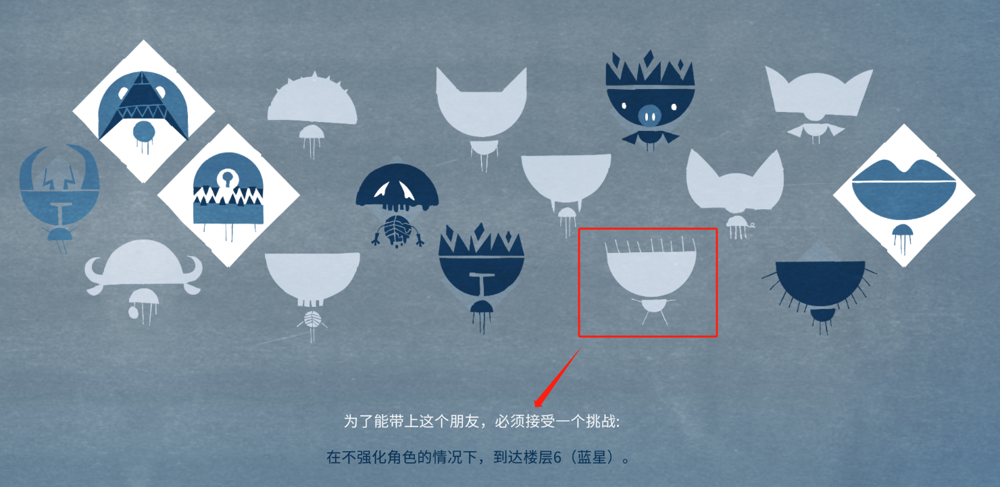

### 3.3.3礼物系统：

  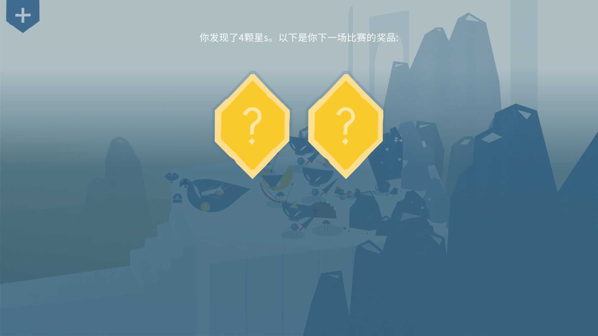
  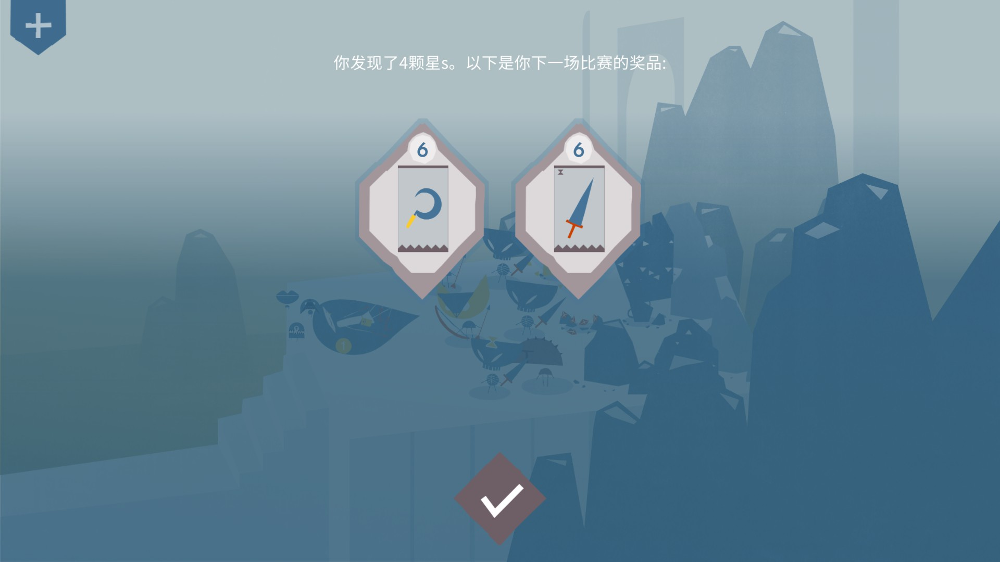
  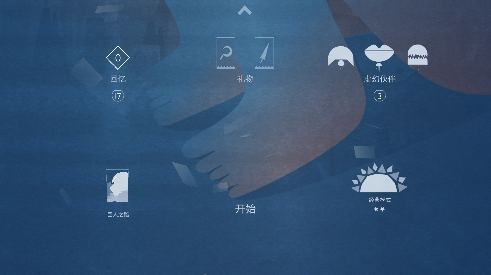

- 【礼物】：每轮游戏结算之后依据玩家当轮获得【星】数量（与击败【恶魔】数等关联）获得的随机Buff，【星】数量越多，Buff越多+越强，【礼物】会在下轮游戏开始时生效。直到下一次结算后被新生成的【礼物】覆盖。

- **UI交互逻辑：**

  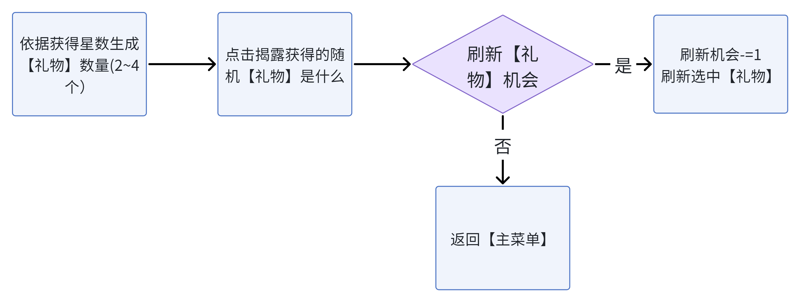

# 四、游戏评价

## 优秀设计：

- 良好结合叙事的机制和角色设计：
  - 作为敌人的【恶魔】是主角内心里负面情感的化身
  - 【回忆】承载碎片化叙事需求，需要玩家一次次在主角精神空间这个【地牢】当中持续寻找，找寻到的【回忆点数】用于永久强化技能，符合“每找回一点过去的自己，自己就更强大一点”的治愈叙事主题
  - 【偷窃】类型卡牌的设计既满足玩家补充解锁强力卡牌的策略玩法，也成功地让玩家通过玩法机制理解叙事上的“战胜负面情绪”，即了解负面情绪到化解负面情绪的过程。
  - 最终Boss战——击败巨人，结合前期提示和叙事暗示巨人的友好，用治疗卡牌治愈巨人，最终揭示巨人即是主角父亲。不仅让玩家反转攻略逻辑，创造惊喜感，同时形成机制与剧情的完整契合。
- 一次性卡牌+动态补充卡牌特色机制：
  - 绝大多数卡牌都是一次性卡牌，玩家需要持续搜寻物资（宝箱、星和水晶）获得卡牌补充，也需要思考强力卡牌的使用策略，创造出了不同于其他竞品（如杀戮尖塔）的流动卡组构建。使玩家无需过分执着于某类流派的build，卡组构成一定会在游戏过程中发生改变。**解决了玩家预期策略和随机结果不匹配产生的挫败感。**
- 场地位移机制：
  - 玩家消灭前方的敌人，后方的敌人紧跟着补充上来，创造单人勇斗人山人海的挑战体验；
  - 敌人攻击范围有限+玩家每回合最后一次行动会暂时冻结敌人移动，创造出0伤战斗的可能，提供给玩家精细策略计算的乐趣；
- 礼物系统：
  - 玩家的局内表现更好就可以获得更多更强的下局buff。使得就算失败，玩家的努力也得到了认可和奖赏，**降低了功亏一篑的挫败感**，因为强力的buff带来初期就能成体系的build，明确给到玩家重开的信心。同时，也**解决了玩家浪费大量时间刷强力初始的问题**，因为玩家必须通过一定关卡才能获得强力初始。

## 缺点设计：

- 太多强力卡牌只能通过偷窃功能的卡牌获取，且偷窃类卡牌需要玩家点亮相关【回忆】才能解锁，过于限制新手玩家的build自由度；
- 强结合叙事的最终boss战导致重玩过程难度曲线骤降。已经知道机制的玩家只需在最终boss房前保证拥有3张治疗卡牌即可无压力过关；重玩情绪体验高点被迫在最终boss房前被截断，使得重玩流程的最终boss战变为无趣的工作流程；
- 视觉上：火焰恶魔+猎犬boss的关卡中遍布与敌人同色的火焰特效，较为严重地降低了识别清晰度；