[TOC]

## 项目概述

该项目旨在实践敏捷开发流程的同时，构造最小化文字描述的玩法系统与关卡。

## 我的职责

- 设计改变敌人行为的道具效果
- 设计并实现关卡

## 关卡设计

### Level 1：

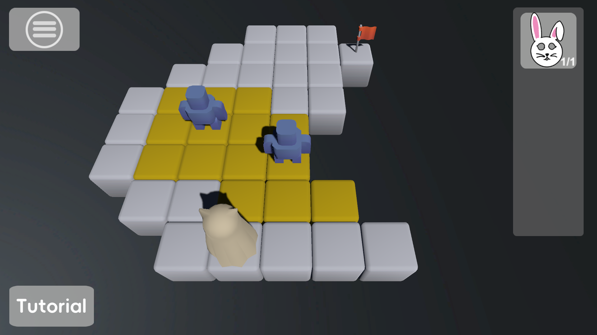
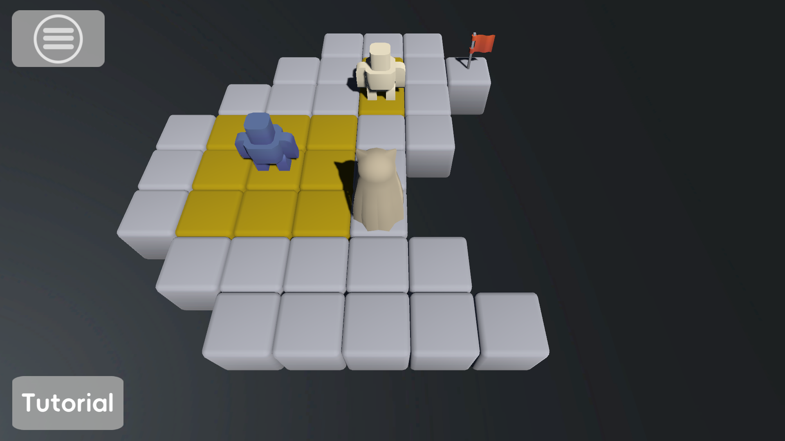

| 项目     | 内容                         |
| -------- | ---------------------------- |
| 关卡目的 | 介绍游戏玩法                 |
| 设计点   | 单一可选项；对比体现道具效果 |

### Level 2：

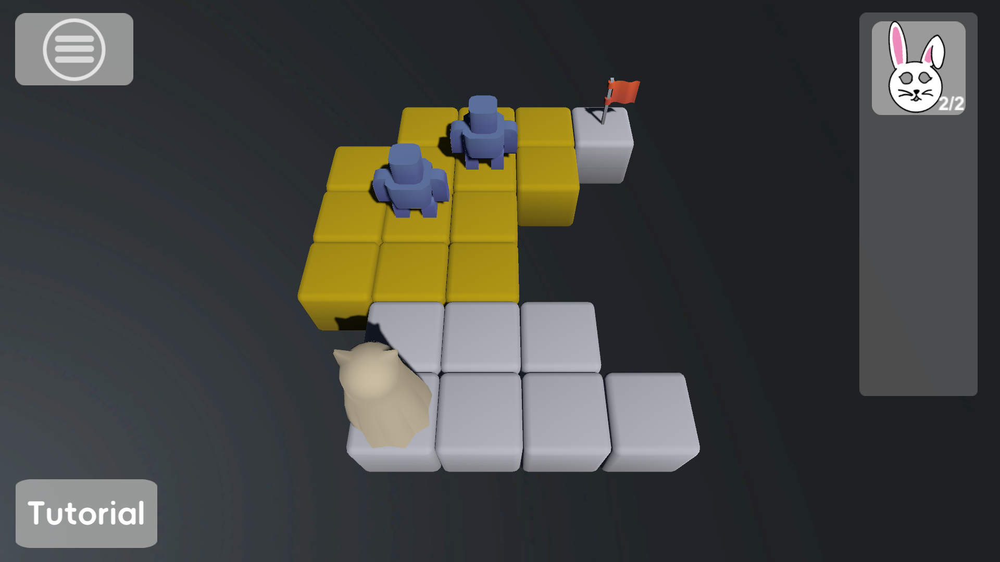

| 项目     | 内容                                                  |
| -------- | ----------------------------------------------------- |
| 关卡目的 | 强化玩家对兔子面具的理解；强化玩家对NPC移动方式的理解 |
| 设计点   | 基于前一关卡的变种关卡；缩小可移动空间突出NPC移动模式 |

### Level 3：

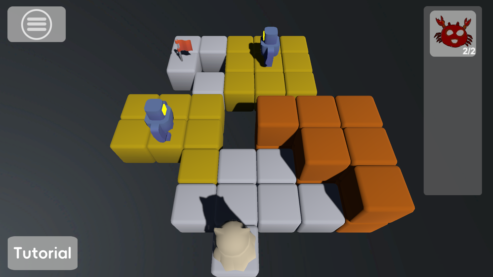
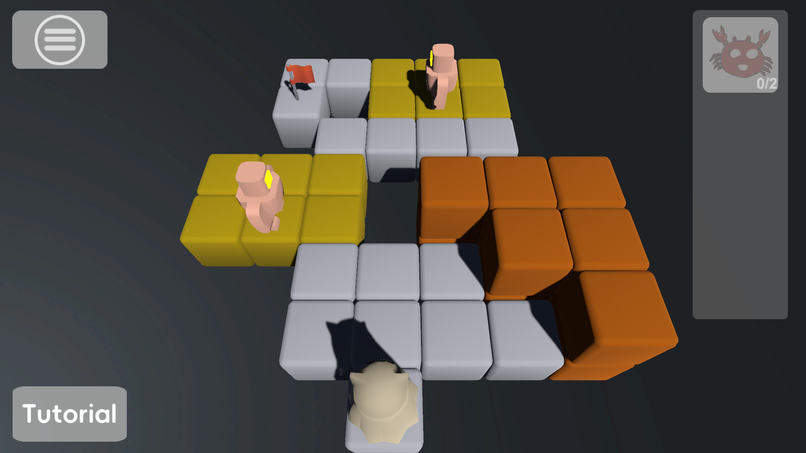

| 项目     | 内容                         |
| -------- | ---------------------------- |
| 关卡目的 | 引入新道具机制；引入墙体方块                |
| 设计点   | 单一路径； |

### Level 4：

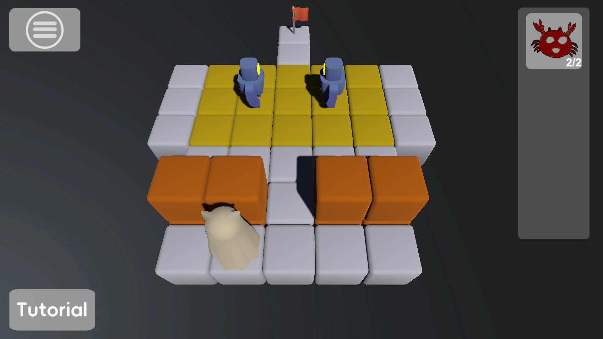
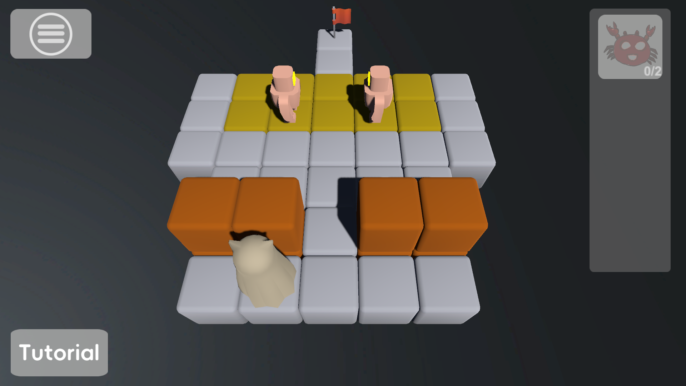

| 项目     | 内容                         |
| -------- | ---------------------------- |
| 关卡目的 | 强化玩家对螃蟹面具的理解；突出NPC之间相遇时的行动逻辑；考验玩家对NPC移动路径的预测能力                |
| 设计点   | NPC路径冲突 |

### Level 5：

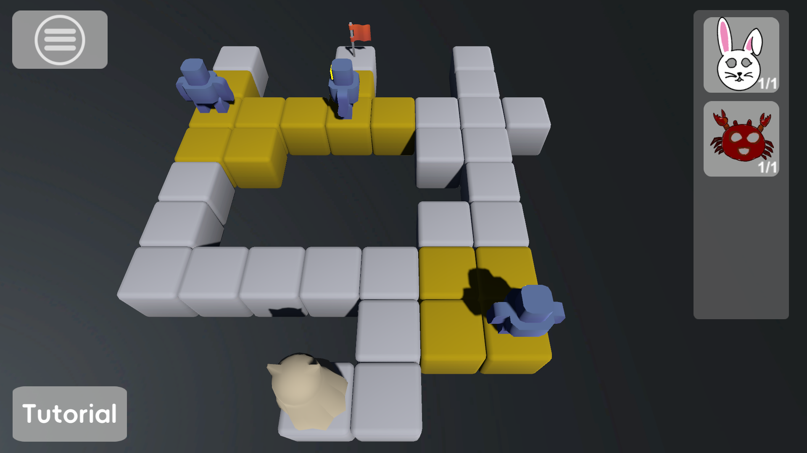
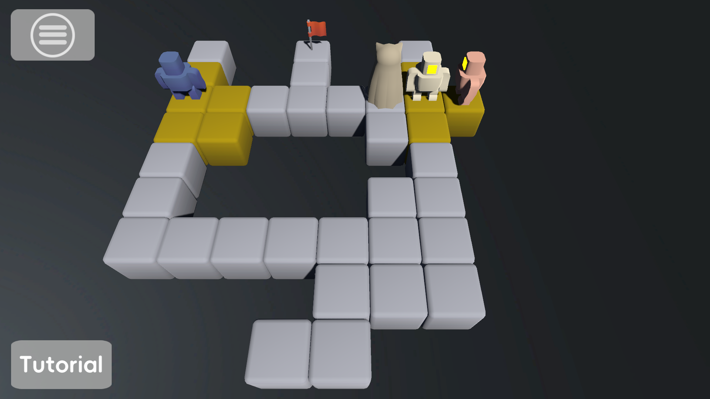

| 项目     | 内容                         |
| -------- | ---------------------------- |
| 关卡目的 | 考验玩家对两种面具的使用；考验玩家对NPC交互机制的判断               |
| 设计点   | 不充足的道具；双路线 |

### Level 6：

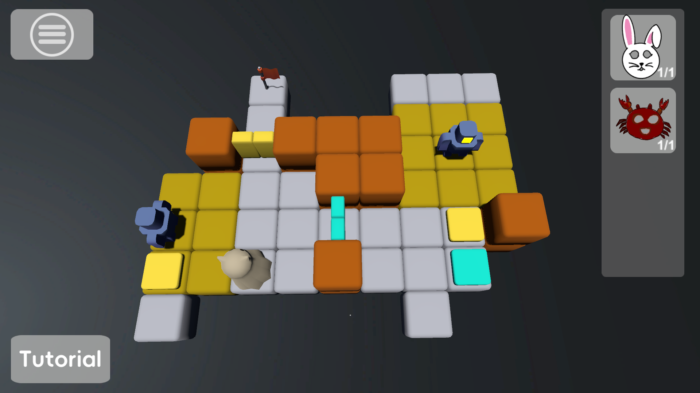

| 项目     | 内容                         |
| -------- | ---------------------------- |
| 关卡目的 | 引入开门踏板机制；考验玩家对timing的掌控力               |
| 设计点   | 远程联动 |

### Level 7：

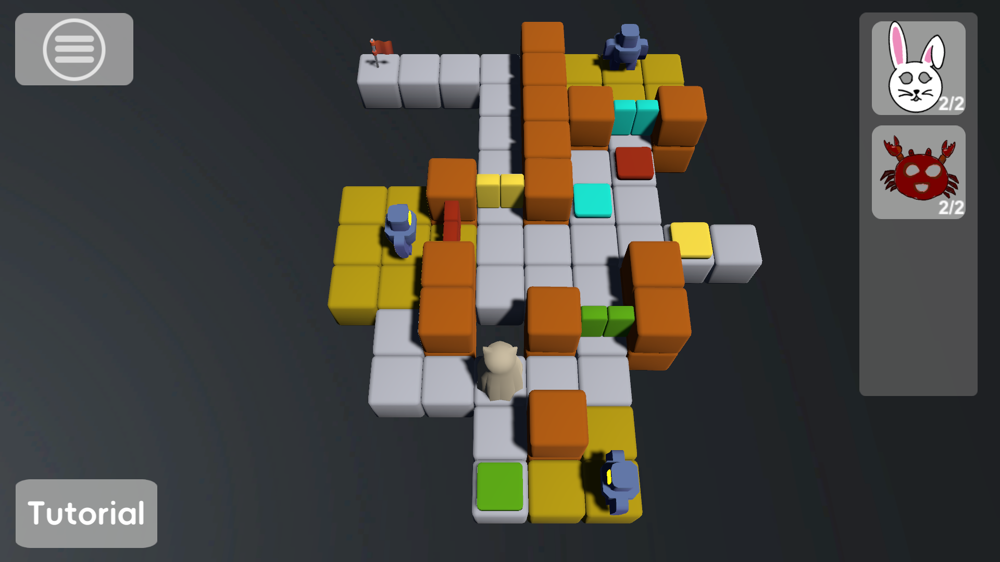

| 项目     | 内容                         |
| -------- | ---------------------------- |
| 关卡目的 | 综合能力考验               |
| 设计点   | 双路线；多踏板联动 |

