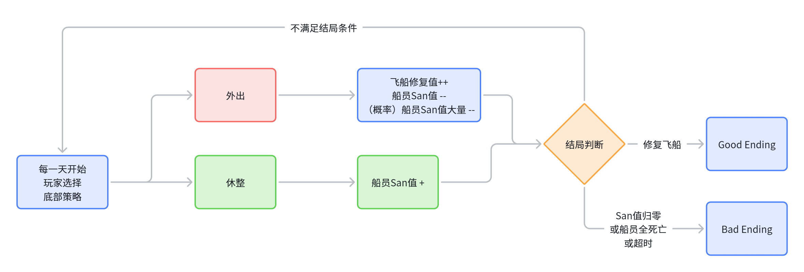
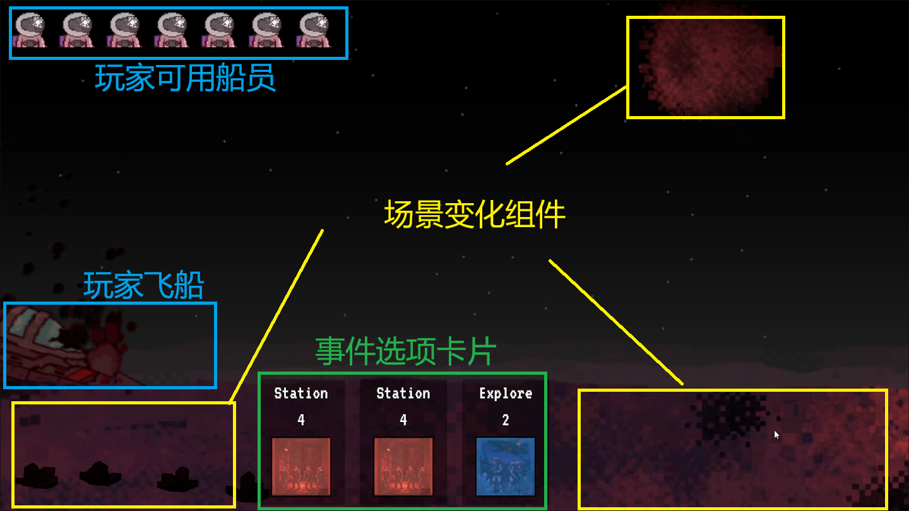
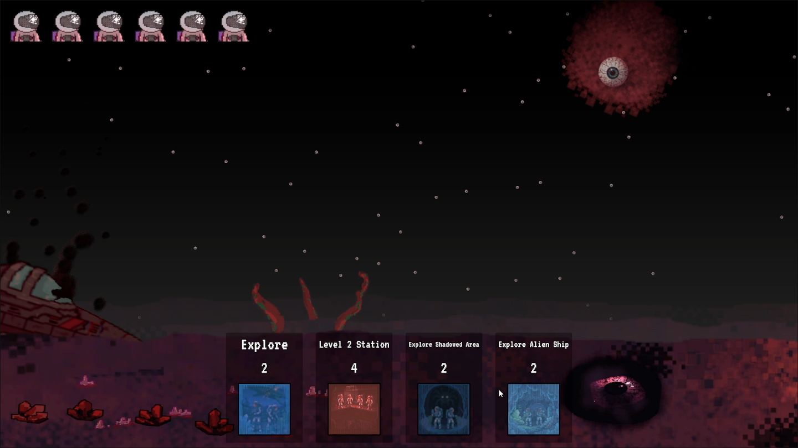
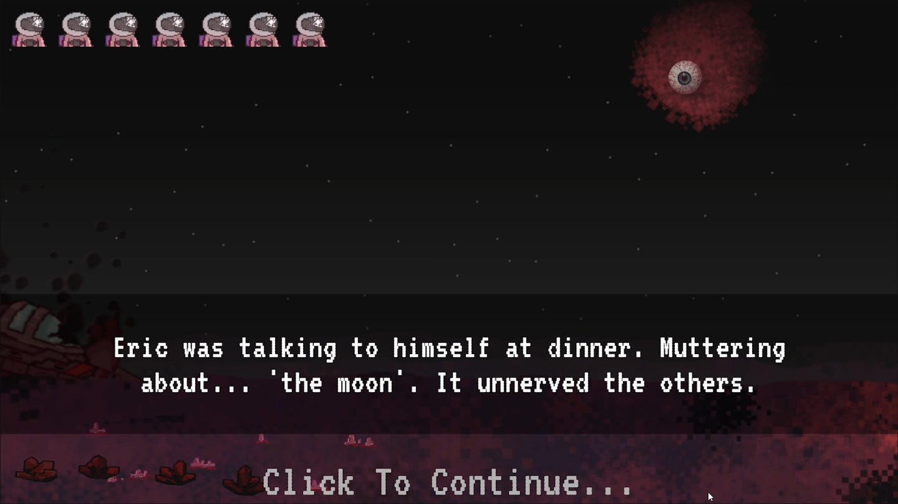
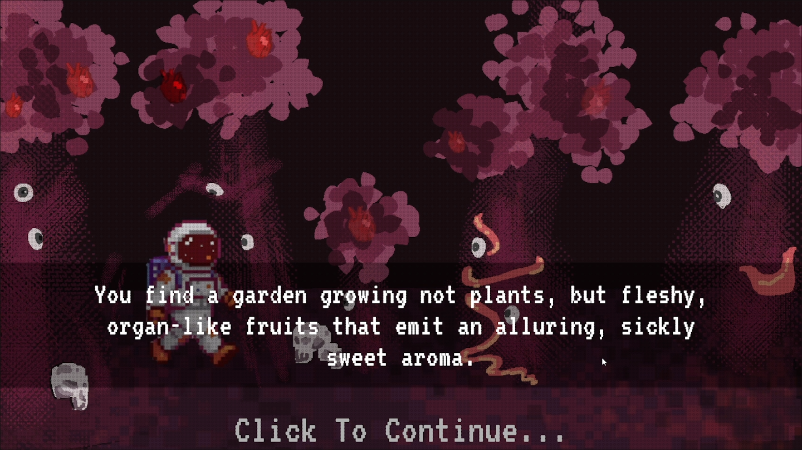
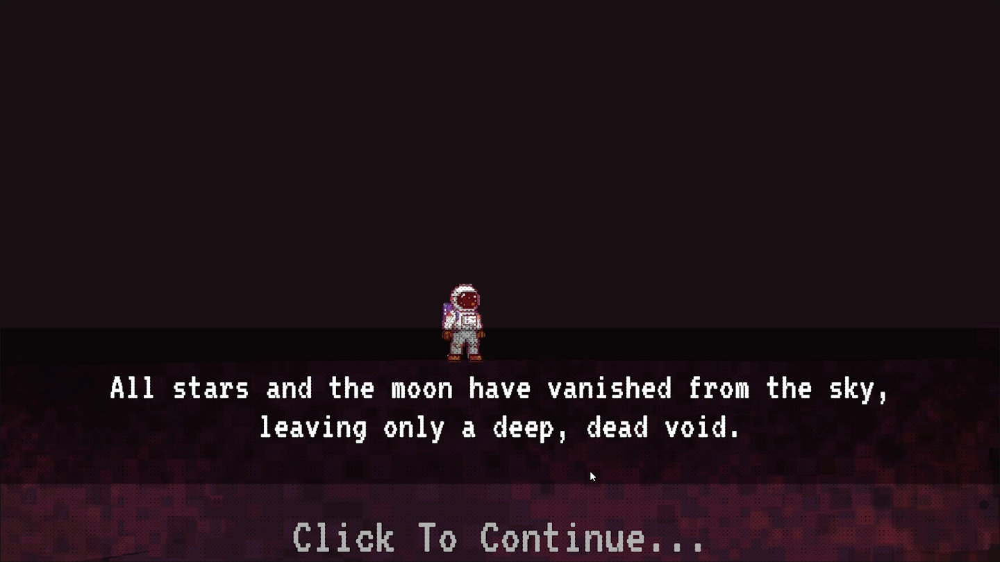
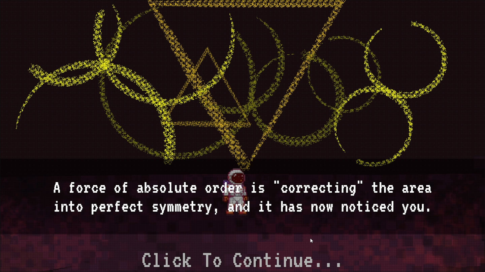

[TOC]

# 0.项目概述

- 项目性质：48h Game Jam
- 游戏类型：轻策略Avg
- GameJam主题：Cosmic horror
  - 确立体验：克氏、未知、恐怖、叙事导向
- 游戏简介：一艘载有七人的飞船因不明原因坠毁在一颗荒凉的星球上。幸运的是，星球上似乎有很多可以用来修复飞船的资源。然而，随着探索的深入，由于某种未知因素的影响，船员们的精神状态逐渐变得不稳定。他们能否成功修复飞船并安全离开？还是会陷入疯狂，最终化作这颗荒凉星球残骸的一部分？
- 游玩链接：https://itzhakrees.itch.io/phobos

# 1.项目职责

- 基于太空恐怖的主题，构建故事世界观
- 设计轻策略资源管理玩法，设计基础交互逻辑
- 撰写文案

# 2.玩法设计

## 2.1核心循环：

游戏按照天数进行，玩家每天从最多4个事件选项中选择，消耗当日可用船员执行；事件每次选择之后会影响玩家 `飞船的修理度`、玩家`船员的san值`和玩家`最大可用船员数`，玩家每次执行事件后会收到本次探索事件的结果；当无可用船员时，玩家结束该天；新一天开始时玩家会收到本日简报；

## 2.3 系统设计点：

**数值对玩家不可见：**

- 满足体验：未知、恐怖
- 设计内容：
  - 飞船修理度不可见：玩家仅能从飞船冒烟/火焰特效、破损玻璃等特征判断飞船修理程度
  - San值不可见：玩家无法量化船员San值，只能从场景变化组件中出现的异状、每日船长日志的文字描述和事件触发时的音效判断

  
  
  

**事件触发多种cg：**

- 满足体验：恐怖、叙事导向
- 设计点：事件产生的正负面影响会伴随不同的音效提示

  
  
  

