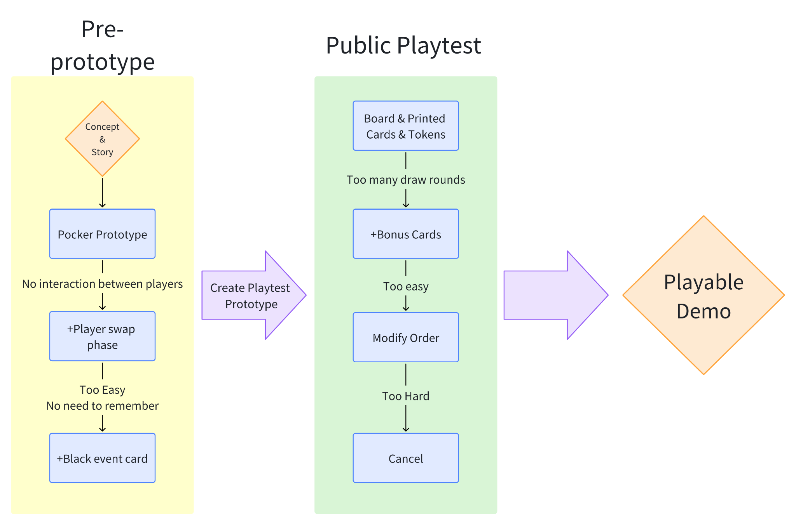

---

id: "Slackoff"
lang: "zh"
status: "published"
featured: true
order: 2
title: "Slack Off"
role: "玩法设计"
summary: "基于记忆玩法的摸鱼主题桌游"
description: "基于记忆玩法的摸鱼主题桌游"
# Add a real project cover at ./img/cover.webp, then set cover to "./img/cover.webp".
cover: "./img/cover.png"
visualClass: "puzzle-card"
coverClass: "puzzle-cover"
tags: ["Game-play Design","Prototype"]
tools: ["Rapid Prototyping"]
date: "2025-10-15"
---

[TOC]

## 1. 游戏概述

- **游戏名称**：摸鱼大王 Slacking Off
- **游戏类型**：轻策略、短期记忆、玩家互动/破坏
- **核心概念**：玩家们是一批在黑心公司里面工作的可怜社畜，成天在老板的各种提效监视下艰难度日。为了保护自己不受工作的折磨，玩家需要记住每天老板多变的监控路线计划，好好规划自己的摸鱼时机，同时提防其他跟你一样的同事竞争摸鱼场所。开动脑筋，胆大心细，避开老板，全力摸鱼，保住自己的工作和休息时光。

---

## 2. 目标受众及竞品

### 目标玩家：
- 喜欢短期记忆游戏的玩家
- 喜欢简单规则游戏的玩家
- 喜欢轻策略游戏的玩家
- 对“摸鱼”主题本身感兴趣的玩家

### 玩法竞品：
- That’s Not A Hat
- 共同点：记忆机制、交换元素

### 本游戏独特之处
- **策略制定**：玩家可以选择放置哪些行动卡，规划最优路线
- **破坏（Sabotage）**：通过交换事件卡或行动卡干扰对手，增加互动性与紧张感

---

## 3. 核心组件

| 组件类型              | 说明                   |
| ----------------- | -------------------- |
| 事件卡（Event Cards）  | 每局公共事件，共5种不同颜色，每种各3张 |
| 行动卡（Action Cards） | 玩家手牌，共4种不同颜色，每种各5张   |
| 场地板               | 用于放置卡牌位置             |
| 积分token           | 标识玩家已有分数             |
| 顺序flag            | 标识第一个行动玩家的顺序指示物      |

**游戏板**：

- 事件卡区：从左到右放置事件卡。
- 玩家卡区：最先行动的玩家，将行动卡放在最上的一行。后行动的玩家则从上到下依次排列。

---

## 4. 游戏流程（基础版）

0. **准备阶段**：分别洗混`事件卡`和`行动卡`
1. **记忆阶段**：从`事件卡`堆中抽取5张卡, 等待所有玩家记住5张`事件卡`。
2. **行动卡补充与放置**：玩家从`行动卡`堆中抽卡至5张，从中选择3张放置在游戏板上。然后翻转所有`事件卡`为背面朝上。
3. **交换老板事件卡**：每个玩家执行两张`事件卡`的位置交换操作, 且下一名玩家不可重复交换上一个玩家选择的两张牌。*例如：玩家a交换1、3位置的`事件卡`后，玩家b不可再次交换1、3位置的卡牌。*
4. **每个玩家与下家交换行动卡**：与下一名玩家交换放置在场上的`行动卡`，被交换卡牌的玩家将获得一次调整一张自己场上`行动卡`位置的权利。*例如：玩家a用自己1号位置的卡牌与下家玩家b的3号位置卡牌交换。玩家b作为补偿，可以调整自己场上三张`行动卡`中的一张的位置，于是玩家b将现在3号位置的卡牌放置到了5号位置上。*
5. **计分与下一轮**：根据规则进行计分，进入下一轮，并调整玩家的行动先后顺序（顺序flag按顺时针传给下一个玩家，原来的一个玩家变为最后一个玩家）。
6. **游戏结束**：当所有玩家都拿到过一遍顺序flag后，游戏结束，统计玩家手中的token数，最多者胜利（可平局）。

---

## 5. 计分方式

- 玩家行动卡的位置与同色事件卡同列，即为**未避开**事件，反之则是**避开**事件
- **避开**同色事件得1分
- **未避开**同色事件则不得分，黑色事件卡会让所有同列行动牌都视作**未避开**事件
- **顶风作案：** 当事件中出现两张同色的事件卡，则该事件为**重点事件**，如果成功**避开**，则双倍得分，但未避开会扣除1分

---

## 7. 测试方法与反馈

### 测试类型
- **组内测试（Within-subjects）**：同一玩家体验多个版本或条件
- **组间测试（Between-subjects）**：不同玩家群体分别测试不同版本

### 希望验证的核心问题
- 如何结束游戏？（胜利条件）
- 最少玩家数量要求？
- 游戏平衡性是否合理？
- 是否易于上手（accessible）？
- 是否存在难以控制或过于随机的部分？
- 玩家在什么情境下产生特定感受？
- 最佳策略是什么？

### 测试中确认的“必须具备”要素
- 记忆（Memorizing）
- 玩家间互动（Interaction between players）
- 紧张感（Tension）
- 破坏（Sabotage）

---

## 8. 迭代过程

### 一阶段：内部构建

- 确定概念
- 使用扑克牌完成可玩规则设计
- 内部玩法测试发现缺少玩家间交互
	- 增加玩家间交换行动牌
- 难度过于简单
	- 增加黑色事件牌
### 二阶段： 玩家测试

- 确定美术风格和资产
- 发现过多平局，缺少竞争胜利的意义
	- 增加顶风作案机制
- 平衡调整

---

## 9. 未来工作（Future Work）

- **美术**：原创艺术设计
- **视觉效果**：提升整体视觉表现
- **无障碍设计**：针对色盲玩家的卡牌标识优化（例如使用符号+颜色双编码）

